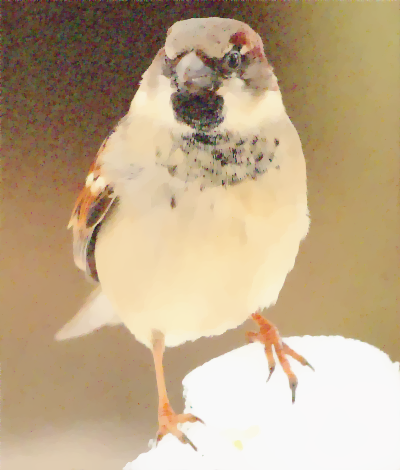

# Image Recovery

## Image recovery algorithms, implemented in Rust.

The solvers on this library are based on the algorithms presented in [Chambolle, A. and Pock, T. (2011)](https://link.springer.com/article/10.1007/s10851-010-0251-1), with modifications inspired by [Bredies, K. (2014)](https://link.springer.com/chapter/10.1007/978-3-642-54774-4_3).

Uses the [`image` crate](https://docs.rs/image/latest/image/) for loading and saving images, and the [`ndarray` crate](https://docs.rs/ndarray/latest/ndarray/index.html) for manipulating matrices.

## How to use:

Declare the dependency in you Cargo.toml

```toml
[dependencies]
image-recovery = "0.1"
```

## Examples:

Examples for each solver can be found in the [`examples` folder](https://github.com/lily-mosquitoes/image-recovery/tree/main/examples), and those can be run with `cargo run --example example_name`. However, a quick example usage is shown below:

### Image denoising (multichannel)

```rust
use image_recovery::{
    image, // re-exported `image` crate
    img::Manipulation, // trait for image::RgbImage manipulation
    solvers, // module with image recovery algorithms
};

fn main() {
    // the `image` crate provides functionality to decode images
    let img = image::open("examples/source_images/angry_birb_noisy.png")
        .expect("image could not be open")
        .into_rgb8(); // the algorithms in this library are implemented for RGB images

    // load the RGB image into an object which is composed
    // of 3 matrices, one for each channel
    let img_matrices = img.to_matrices();

    // choose inputs for the denoising solver:
    // according to Chambolle, A. and Pock, T. (2011),
    // tau and lambda should be chosen such that
    // `tau * lambda * L2 norm^2 <= 1`
    // while `L2 norm^2 <= 8`
    // If we choose `tau * lambda * L2 norm^2 == 1`, then:
    let tau: f64 = 1.0 / 2_f64.sqrt();
    let sigma: f64 = 1_f64 / (8.0 * tau);

    // lambda drives the dual objective function
    // closer to zero results in a smoother output image
    // closer to infinity results in an output closer to the input
    let lambda: f64 = 0.0259624705;

    // gamma is a variable used to update the internal
    // state of the algorithm's variables, providing
    // an accelerated method for convergence.
    // Chambolle, A. and Pock, T. (2011), choose
    // the value to be `0.35 * lambda`
    let gamma: f64 = 0.35 * lambda;

    // choose bounds for denoising solver
    // the algorithm will run for at most `max_iter` iterations
    let max_iter: u32 = 500;
    // the algorithm will stop running if:
    // `convergence_threshold < norm(current - previous) / norm(previous)`
    // where `current` is the output candidate for the current iteration,
    // and `previous` is the output candidate of the previous iteration.
    let convergence_threshold = 10_f64.powi(-10);

    // now we can call the denoising solver with the chosen variables
    let denoised = solvers::denoise_multichannel(&img_matrices, lambda, tau, sigma, gamma, max_iter, convergence_threshold);

    // we convert the solution into an RGB image format
    let new_img = image::RgbImage::from_matrices(&denoised);

    // encode it and save it to a file
    new_img.save("examples/result_images/angry_birb_denoised_multichannel.png")
        .expect("image could not be saved");
}
```

This should provide the following result:

Source image: | Output image:
---|---
 | 

## Testing

Tests can be run with `cargo test`. Unittests and Doc-tests are provided.

Note that the Doc-test in `src/lib.rs` will run very slowly in debug mode, it is recommended to run tests in release mode: `cargo test --release`.

## Benchmarking

Benchmarking can be run with `cargo bench`.

## Copyright

This code is licensed under the GNU Affero General Public License version 3 or later. See [LICENSE](https://github.com/lily-mosquitoes/image-recovery/blob/main/LICENSE) or https://www.gnu.org/licenses/agpl-3.0.en.html.

## Acknowledgements

Code by [Lílian Ferreira de Freitas](https://github.com/lily-mosquitoes),
mathematics by [Emilia L. K. Blåsten](https://orcid.org/0000-0001-6675-6108)
